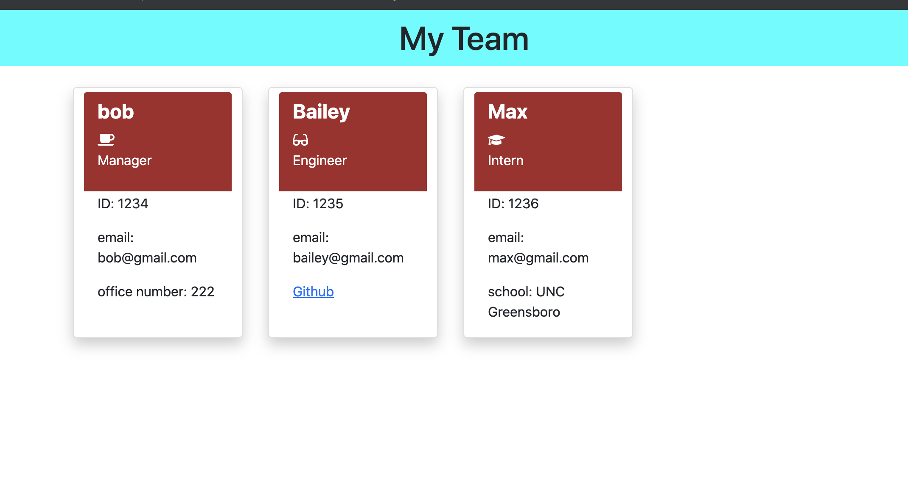

# my-team-profile-generator

## Description 
This is a command-line application that takes in information about each employee on a software engineering team and generates an HTML webpage that displays a company profile for either a manager, engineer or intern. 

## Installation
npm install, inquirer, and node js file system.
  
  

## Usage
Respond to each question for however many employees (engineers or interns) you want to add.

## Links
[Link to demo](https://youtu.be/9U96oMR5lyo)
